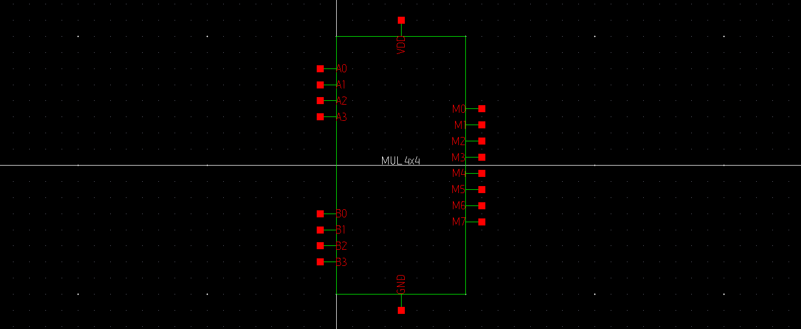
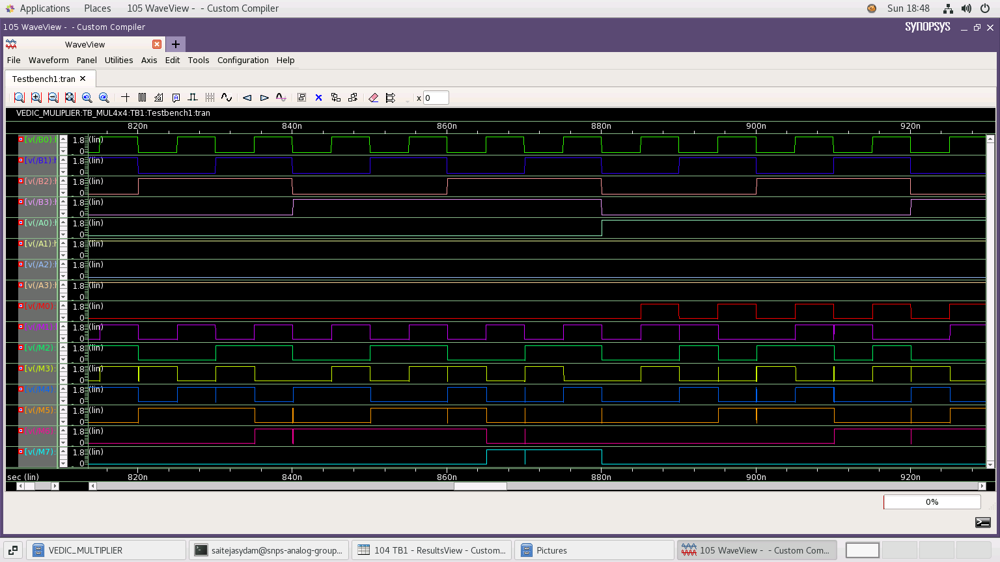

# Implementation of 4x4 Vedic Multiplier in 28nm CMOS Technology

A multiplier is one of the most frequently used digital circuits in ALU, digital signal processing applications, and communication systems. In this work, an Urdhva-Tiryagbhyam 4x4 Vedic multiplier, which is one of the fastest multipliers that exists in the present literature, is implemented using 28nm CMOS technology-based basic NAND gates. This project is done with the help of Synopys Custom Compiler

## Table of Contents

1. [Introduction](#Introduction)
   - [Circuit Diagram](#Circuit-Design)
   - [Reference Waveforms](#Reference-Waveforms)
2. [Tools Used](#Tools-Used)
3. [Procedure](#Procedure)
   - [Identifying cells required](#Identifying-cells-required)
   - [Implementation](#Implementation)
4. [Results](#Results)
5. [Netlist](#Netlist)
6. [Acknowledgements](#Acknowledgements)
7. [References](#References)
8. [Author](#Author)

## Introduction

High-speed and low-power multipliers are required for any signal processing components such as FFT, Convolution, Filters, etc. A simple multiplication takes a lot of time than any operation. So, it needs to be faster. Some algorithms can be used to reduce computational complexity and thus achieve faster computation. Many multiplier designs are existing in the literature. Some of them are booth algorithm-based, walltree technique based, etc. Urdhva-Tiryagbhyam Algorithm is one of the computational-efficient multiplication algorithms among all multiplication algorithms and is the best among 16 sutras in Vedic mathematics in terms of computation [1]. 

In this work, A Vedic 4x4 multiplier that uses Urdhva Tiryagbhyam Algorithm will be implemented. It takes two 4- bit inputs and gives one 8-bit output which is the multiplication of the given two 4-bit inputs.

### Circuit Design

| 2x2 Vedic Multiplier                                         | 4x4 Vedic Multiplier                                         |
| ------------------------------------------------------------ | ------------------------------------------------------------ |
|  |  |

### Reference Waveforms

## Tools Used

1. [Synopsys Custom Compiler™](https://www.synopsys.com/content/dam/synopsys/implementation&signoff/datasheets/custom-compiler-ds.pdf)
2. Synopsys Primewave
3. Synopsys 28nm PDK

## Procedure

### Identifying cells required

- A 4x4 Vedic multiplier requires four 2x2 Vedic multipliers and three 4-bit ripple-carry adders for its implementation. The block diagram of the circuit is shown in Fig. 2. 
- A 2x2 multiplier shown in Fig. 1 can be implemented using 4 NAND gates, 4 Inverters and 2 Half Adders.
- A 4-bit ripple-carry adders requires 4 Full Adders.
- A Half Adder needs and 4 NAND gates and an inverter, while Full Adder need 9 NAND Gates.

Thus, implementing 4x4 Vedic multiplier needs 

1. Inverter
2. NAND Gate
3. Half Adder
4. Full Adder
5. 4-bit Ripple Carry Adder
6. 2x2 Vedic Multiplier.

### Implementation

#### Step 1: Design Necessary Cells

##### Inverter

Schematic:

Symbol:

##### NAND Gate

Schematic:

Symbol:

##### Half Adder

Schematic:

  

Symbol:

##### Full Adder

Schematic:

Symbol:

  

##### Ripple Carry Adder

Schematic:

  

Symbol:

##### 2x2 Vedic Multiplier

Schematic:

Symbol:

#### Step 2: Verify the cells by giving appropriate input voltage pulses

##### INVERTER

##### NAND Gate

##### Half Adder

##### Full Adder

##### 4-bit Ripple Carry Adder

##### 2x2 Vedic Multiplier

#### Step 3: Design the 4x4 Vedic Multiplier

**Schematic:**

**Symbol:**

#### Step 4: Test the final cell

## Results

##### INVERTER

##### NAND Gate

##### HALF ADDER

FULL ADDER

##### 4-bit RIPPLE CARRY ADDER

##### 2x2 Vedic Multiplier

##### 4x4 Vedic Multiplier

| Expected Waveform                                          | Obtained Waveform                                        |
| ---------------------------------------------------------- | -------------------------------------------------------- |
|  |  |

For the inputs A0, A1, A2, A3 & B0, B1, B2, B3 the outputs M0, M1, M2, M3, M4, M5, M6 and M7 are obtained.

The obtained waveform is quite similar to expected (simulation) waveforms. 

## Netlist

| Circuit                  | Schematic                                                    | Testbench                                                    |
| ------------------------ | ------------------------------------------------------------ | ------------------------------------------------------------ |
| Inverter                 | [VEDIC_MULIPLIER_INVERTER.sp](netlists\VEDIC_MULIPLIER_INVERTER.sp) | [VEDIC_MULIPLIER_TB_INVERTER.sp](netlists\VEDIC_MULIPLIER_TB_INVERTER.sp) |
| NAND Gate                | [VEDIC_MULIPLIER_NAND2.sp](netlists\VEDIC_MULIPLIER_NAND2.sp) | [VEDIC_MULIPLIER_TB_NAND.sp](netlists\VEDIC_MULIPLIER_TB_NAND.sp) |
| Half Adder               | [VEDIC_MULIPLIER_HALF_ADDER.sp](netlists\VEDIC_MULIPLIER_HALF_ADDER.sp) | [VEDIC_MULIPLIER_TB_HALF_ADDER.sp](netlists\VEDIC_MULIPLIER_TB_HALF_ADDER.sp) |
| Full Adder               | [VEDIC_MULIPLIER_FULL_ADDER.sp](netlists\VEDIC_MULIPLIER_FULL_ADDER.sp) | [VEDIC_MULIPLIER_TB_FULL_ADDER.sp](netlists\VEDIC_MULIPLIER_TB_FULL_ADDER.sp) |
| 4-bit Ripple Carry Adder | [VEDIC_MULIPLIER_CARRY_ADDER_4BIT.sp](netlists\VEDIC_MULIPLIER_CARRY_ADDER_4BIT.sp) | [VEDIC_MULIPLIER_TB_CARRY_ADDER.sp](netlists\VEDIC_MULIPLIER_TB_CARRY_ADDER.sp) |
| 2x2 Multiplier           | [VEDIC_MULIPLIER_MUL_2x2.sp](netlists\VEDIC_MULIPLIER_MUL_2x2.sp) | [VEDIC_MULIPLIER_TB_MUL_2x2.sp](netlists\VEDIC_MULIPLIER_TB_MUL_2x2.sp) |
| 4x4 Multiplier           | [VEDIC_MULIPLIER_MUL_4x4.sp](netlists\VEDIC_MULIPLIER_MUL_4x4.sp) | [VEDIC_MULIPLIER_TB_MUL4x4.sp](netlists\VEDIC_MULIPLIER_TB_MUL4x4.sp) |

## Acknowledgements

1. [Cloud Based Analog IC Design Hackathon](https://www.iith.ac.in/events/2022/02/15/Cloud-Based-Analog-IC-Design-Hackathon/)
2. [Synopsys India](https://www.synopsys.com/)
3. [VLSI System Design (VSD) Corp. Pvt. Ltd India](https://www.vlsisystemdesign.com/)

## References

[1] Bansal, Yogita, Charu Madhu, and Pardeep Kaur. ”High speed vedic multiplier designs-A review.” 2014 Recent Advances in Engineering and Computational Sciences (RAECS). IEEE, 2014. 

[2] Patel, Chiranjit R., et al. ”Vedic Multiplier in 45nm Technology.” 2020 Fourth International Conference on Computing Methodologies and Communication (ICCMC). IEEE, 2020. 

[3] Taco, Ramiro, Itamar Levi, Marco Lanuzza, and Alexander Fish. ”Low voltage logic circuits exploiting gate level dynamic body biasing in 28 nm UTBB FD-SOI.” Solid-State Electronics 117 (2016): 185-192.

## Author

Sydam Sai Teja, M.Tech (VLSI Design) Student, Vellore Institute of Technology, Vellore-632014, TAMILNADU
